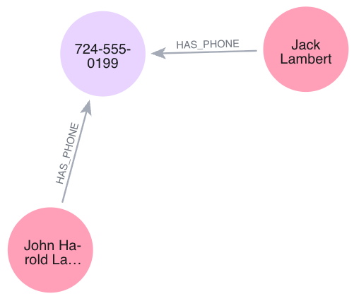

# Identify_Fraud_Detection 🔍

A graph-based fraud detection engine built with **Python** and **Neo4j AuraDB**. This project demonstrates how to identify "Synthetic Identities" and "First-Party Fraud" by uncovering hidden relationships between customer entities.

## The "Smoking Gun" Investigation
In this project, I moved beyond traditional tabular data to visualize and automate the detection of fraud rings. 


## 🏦 Banking Risk & Regulatory Context

In a financial institution like **PNC**, fraud detection isn't just about catching a "bad guy"; it's about managing specific risk vectors and maintaining regulatory compliance. 

### 1. Synthetic Identity Fraud (SIF)
By linking disparate names to a single phone number (724-555-0199), this engine detects **Synthetic Identity Fraud**. This is where a fraudster combines real and fake information to create a "new" person who doesn't exist, often costing banks billions in unrecoverable credit losses.

### 2. KYC & AML Compliance
This graph-based approach strengthens **Know Your Customer (KYC)** protocols. By visualizing connections between entities, we can identify "Coordinated Fraud Rings" that traditional linear databases might miss, aiding in **Anti-Money Laundering (AML)** monitoring.

### 3. Reducing False Positives
Traditional rule-based systems often flag legitimate customers by mistake. Graph analysis allows for **contextual verification**, ensuring that we only flag high-risk clusters while providing a seamless experience for genuine PNC customers.

### Case Study: Entity Resolution (The Lambert Ring)
During execution, the system identified a high-risk connection:
* **Customer A:** Jack Lambert
* **Customer B:** John Harold Lambert
* **Shared PII:** Phone Number 724-555-0199

**The Insight:** In a standard database, these might look like two separate customers. In this graph, we can see they are likely the same individual or part of a coordinated fraud ring using **Identity Variation** to bypass credit checks or internal controls.

---

## 🛠️ Technical Stack
* **Database:** Neo4j AuraDB (Graph Database)
* **Language:** Python 3.x
* **Libraries:** `neo4j` (official driver), `python-dotenv`
* **Workflow:** Git/GitHub for version control and secure credential management.

## 📂 Project Structure
* `fraud_detector.py`: The main Python engine that queries the graph for PII overlaps.
* `.env.example`: Template for environment variables (AuraDB credentials).
* `.gitignore`: Ensures sensitive database credentials are never leaked.
* `requirements.txt`: List of dependencies for easy environment replication.

## ⚙️ Setup & Installation
1. **Clone the repo:**
   ```bash
   git clone [https://github.com/macicchino/Identity_Fraud_Detection.git](https://github.com/macicchino/Identity_Fraud_Detection.git)
   cd Identity_Fraud_Detection

## Neo4j Aura Relational Chart
Below is a chart. 
